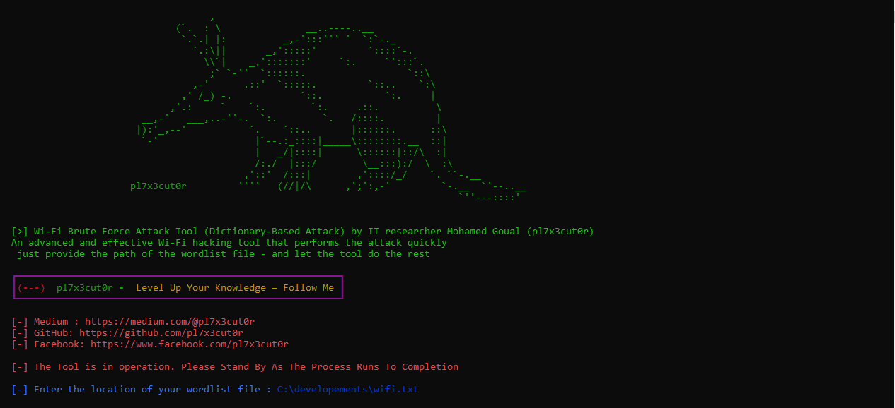

# 📡 Advanced Wi-Fi Brute Force Toolkit - Shadow Edition

  
## 📌 Overview
I Present To You WPF-Tool, A Tool Developed By E7x3cutor, Designed To Perform Brute Force Attacks Using A Comprehensive Password Dictionary. This Tool Attempts To Test Passwords One By One, Systematically Revealing The Correct Password
## ✨ Features
- 🖥 **Easy Interface**  
- 🚀 **Fast Performance**  
- 📶 **Works with Networks Using MAC Address Passwords**  
- 📊 **Save Progress and Continue Later**

## 🛠️ Installation

    

 

## 📚 Documentation

  
To view the user guide for the tool, read a detailed article on Medium:

  

